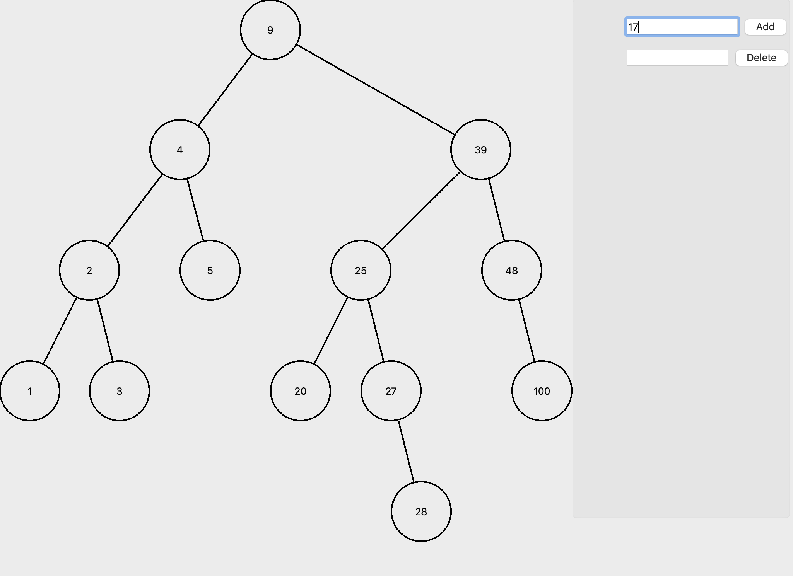
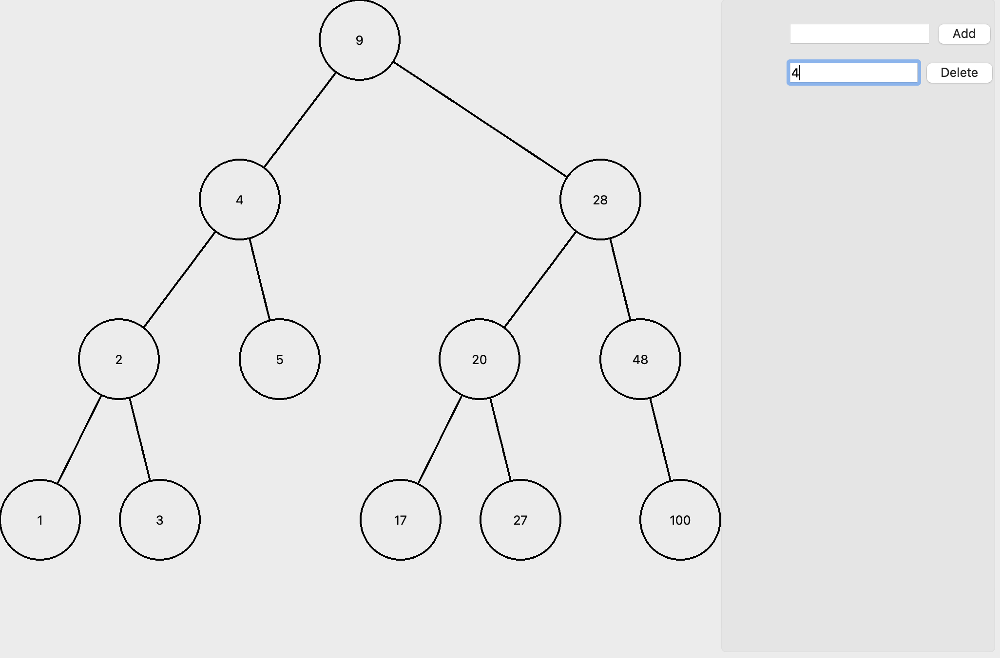

# AVL-simple-animation

This repository contains a Qt Widget Application with ability to display AVL-tree. It supports 2 types of operations:
* Add a vertex to tree (integer number)
* Delete a vertex from tree (integer number)

The implementation of AVL-tree is effective and works using  time complexity.

This is a simple school project (homework) which was made by me in one day.

<!--  -->

# How does it look?

